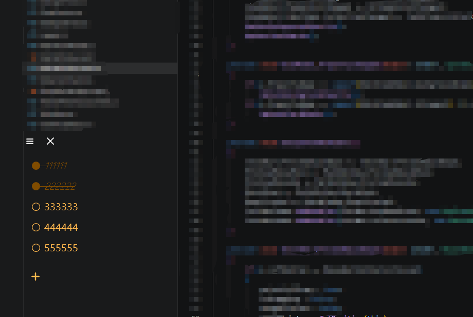

# LiteNote极简便签

轻量化的便签程序，拥有透明化，置顶，自定义颜色等功能。\
A lightweight note app with transparency, always-on-top, and custom color features.\


## 中文文档

### 项目概述

LiteNote 是一款轻量级便签应用，专注于提供简洁、高效的待办事项管理体验。

- **透明模式**：支持窗口透明度调节，可叠加在其他应用上方
- **置顶功能**：保持窗口始终在桌面最顶层，不会被其他窗口遮挡
- **自定义颜色**：支持修改字体颜色和主题颜色，满足个性化需求
- **宽度自适应**：根据待办事项内容自动调整窗口宽度
- **右键菜单**：支持删除单个项目和批量删除已完成项目
- **内联编辑**：双击待办事项可直接编辑内容

### 构建指南

#### 依赖项

- .NET 10.0 SDK 或更高版本

#### 环境搭建

1. 安装 [.NET 10.0 SDK](https://dotnet.microsoft.com/download/dotnet/10.0)
2. 克隆仓库：`git clone https://github.com/nanatuo/LiteNote.git`

#### 构建命令

**框架依赖版本（需安装 .NET 运行时）**：

```bash
# 进入项目目录
cd SimpleNotesApp

# 构建 Release 版本
dotnet build -c Release --runtime win-x64

# 发布（框架依赖）
dotnet publish -c Release -r win-x64 --self-contained false -o publish/x64-framework
```

**单文件自包含版本（无需安装 .NET 运行时）**：

```bash
# 进入项目目录
cd SimpleNotesApp

# 发布（单文件 + 压缩）
dotnet publish -c Release -r win-x64 --self-contained true --single-file true /p:EnableCompressionInSingleFile=true -o publish/x64-singlefile
```

## English Documentation

### Project Overview

LiteNote is a lightweight note-taking application focused on providing a clean, efficient todo management experience.

- **Transparency Mode**: Supports window transparency adjustment, can overlay on other applications
- **Always-on-Top**: Keeps the window at the top of the desktop, not blocked by other windows
- **Custom Colors**: Supports modifying font color and theme color for personalized needs
- **Width Auto-adjustment**: Automatically adjusts window width based on todo content
- **Context Menu**: Supports deleting single items and batch deleting completed items
- **Inline Editing**: Double-click todo items to edit content directly

### Build Instructions

#### Dependencies

- .NET 10.0 SDK or higher

#### Environment Setup

1. Install [.NET 10.0 SDK](https://dotnet.microsoft.com/download/dotnet/10.0)
2. Clone the repository: `git clone https://github.com/nanatuo/LiteNote.git`

#### Build Commands

**Framework-dependent version (requires .NET runtime)**:

```bash
# Enter project directory
cd SimpleNotesApp

# Build Release version
dotnet build -c Release --runtime win-x64

# Publish (framework-dependent)
dotnet publish -c Release -r win-x64 --self-contained false -o publish/x64-framework
```

**Single-file self-contained version (no .NET runtime required)**:

```bash
# Enter project directory
cd SimpleNotesApp

# Publish (single-file + compression)
dotnet publish -c Release -r win-x64 --self-contained true --single-file true /p:EnableCompressionInSingleFile=true -o publish/x64-singlefile
```

